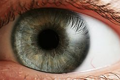

# Baseline Pupil Size and Intelligence 
2018 | 7 | 23 Last compiled: `r Sys.Date()`
<a href="https://www.ncbi.nlm.nih.gov/pubmed/27821254" target="_blank">Click here for the paper</a>

<a href = "https://dillonfreed.github.io/df.github.io/index.html">

# Pavlovian psychopharmacology: the associative basis of tolerance.
2018 | 7 | 23 Last compiled: `r Sys.Date()`
<a href="https://www.ncbi.nlm.nih.gov/pubmed/10975617" target="_blank">Click here for the paper</a>

# Development as a Dynamic System
2018 | 7 | 23 Last compiled: `r Sys.Date()`
<a href="http://www.indiana.edu/~cogdev/labwork/dynamicsystem.pdf" target="_blank">Click here for the paper</a>
